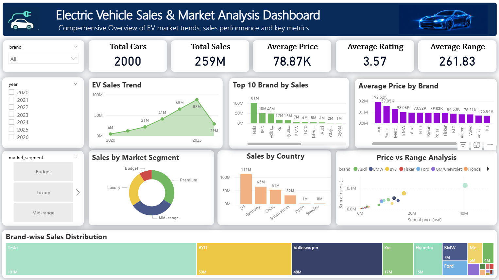

# 🚗 Electric Vehicle Sales & Market Analysis

## 📌 Project Overview
This project analyzes Electric Vehicle (EV) sales data using Python, SQL, and Power BI to discover sales trends, market performance, and business insights.

## 🛠 Tools & Technologies
- Python (Pandas, NumPy, Matplotlib, Seaborn)
- MySQL
- Power BI
- GitHub

## 📂 Dataset
- EV Dataset (.csv)
- 2,000 Records
- 24 Columns

## 📊 Project Workflow
1. Data Cleaning using Python
2. Exploratory Data Analysis (EDA)
3. SQL Analysis
4. Power BI Dashboard
5. Business Insights

## 📈 Dashboard

## 📁 Project Files

- 📓 EV_Data Python Project.ipynb
- 🗄️ EV_Data SQL Project.sql
- 📊 Power Bi ev_data set Project.pbix
- 📄 ev_dataset.csv
- 🖼️ dashboard.png

## 📌 Key Insights

- Tesla has the highest annual sales.
- Premium EVs dominate the market.
- USA contributes the highest EV sales.
- Luxury EVs have the highest average prices.
- Long-range EVs are mainly premium models.

## 👨‍💻 Author

**Nandha**

GitHub: https://github.com/nandhah1126-NP
